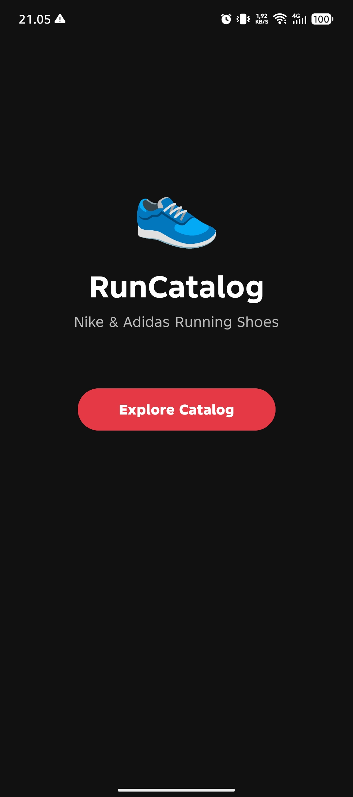
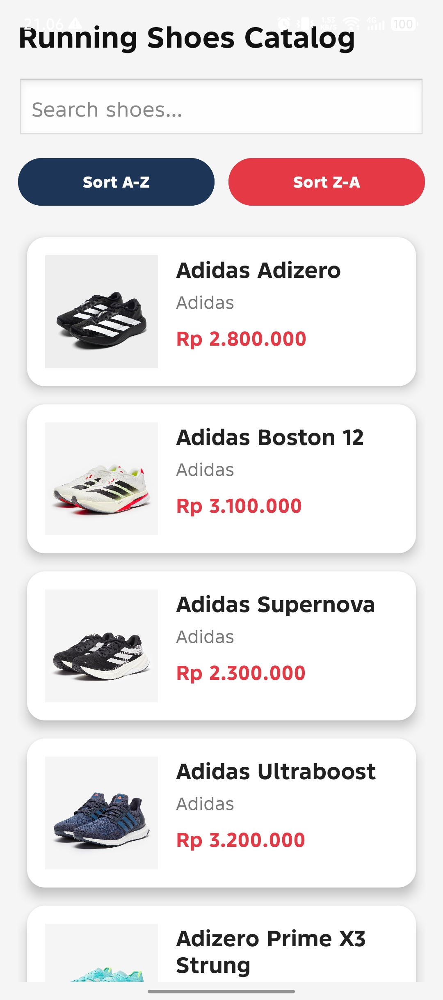
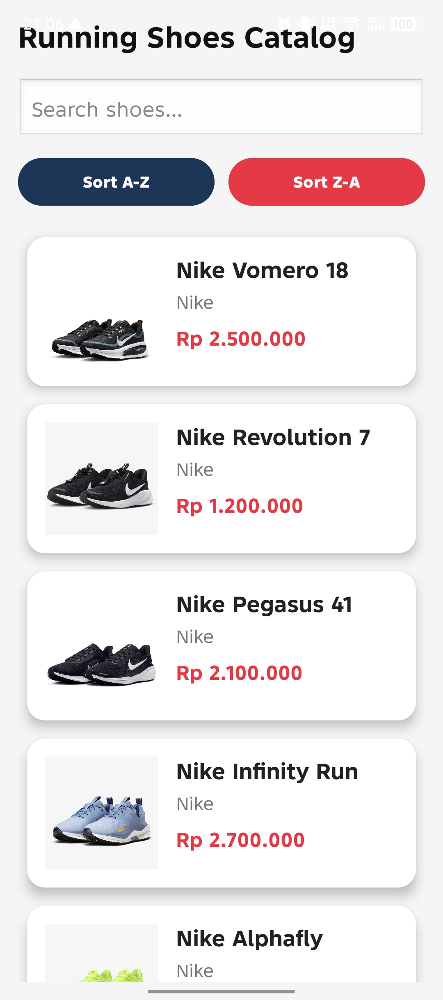
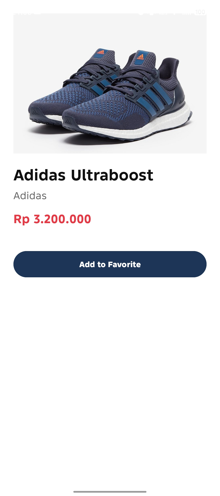
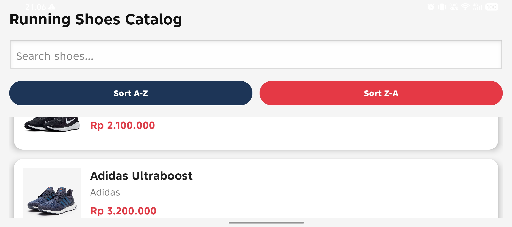

# Running Shoes Catalog

Nama : Gede Andika Ardana
NIM : 42430022

## Deskripsi Aplikasi
Aplikasi ini adalah katalog sepatu running Nike dan Adidas yang dibuat menggunakan Android Studio dan bahasa Java.  
Aplikasi memiliki fitur pencarian data, sorting data, detail produk, dan perpindahan halaman menggunakan intent.

## Fitur Aplikasi
- Tampilan UI responsive
- RecyclerView catalog
- Search shoes
- Sorting A-Z dan Z-A
- Detail produk
- Favorite form
- Intent navigation
- Try-catch error handling
- Logcat menggunakan NIM

## Modul yang Digunakan

### Modul 2 & 3
UI interaktif, adaptif, dan responsive.

### Modul 4 & 5
Intent, variabel, perulangan, percabangan, dan validasi input.

### Modul 6
Struktur data Array dan algoritma pencarian Linear Search.

### Modul 7
Algoritma sorting A-Z dan Z-A.

### Modul 9
Try-catch dan Logcat.

## Screenshot Aplikasi

### Home Page

### Catalog Page

### Search Feature

### Sorting Feature

### Detail Product

### Landscape Mode

